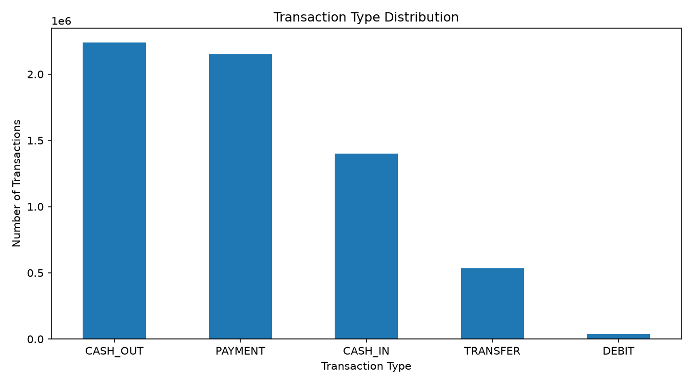
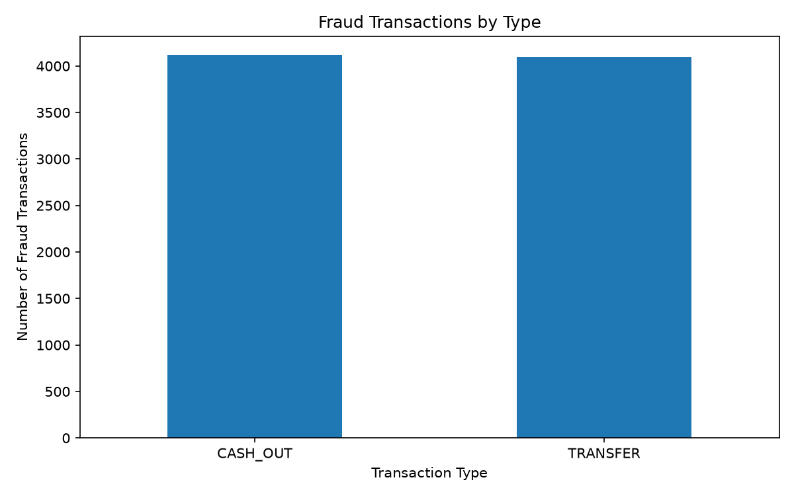
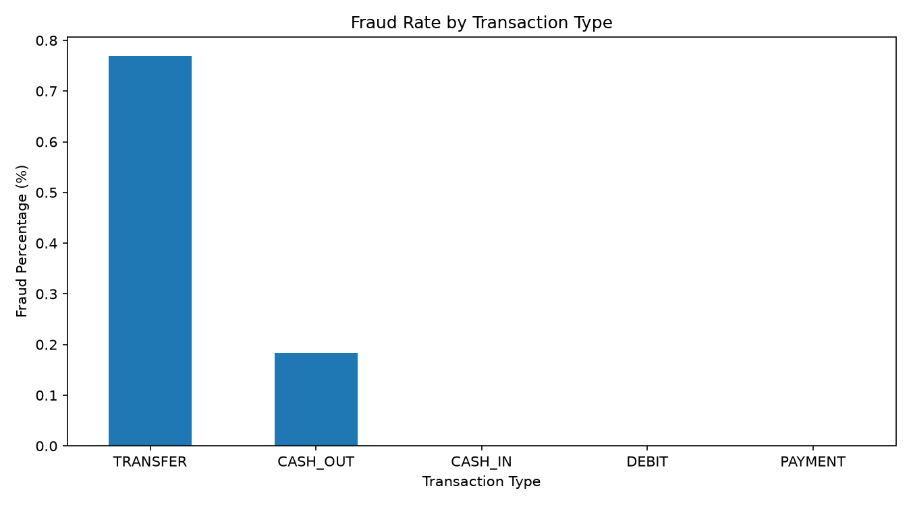
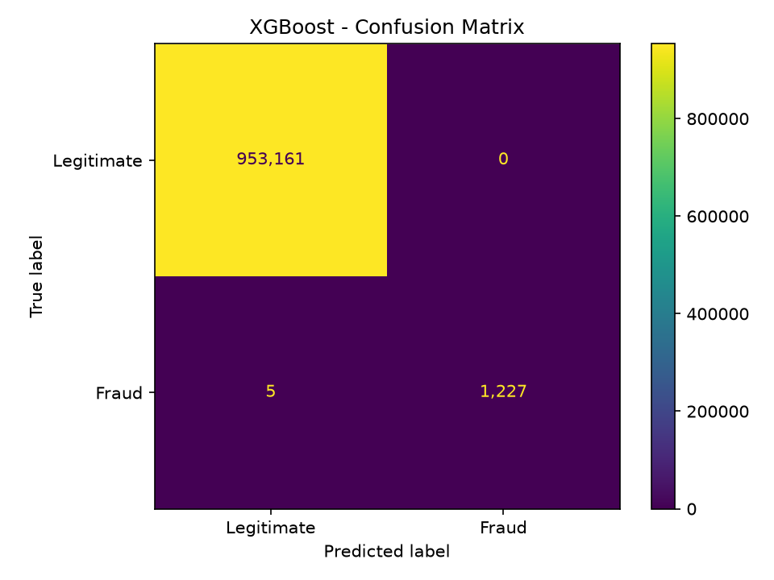
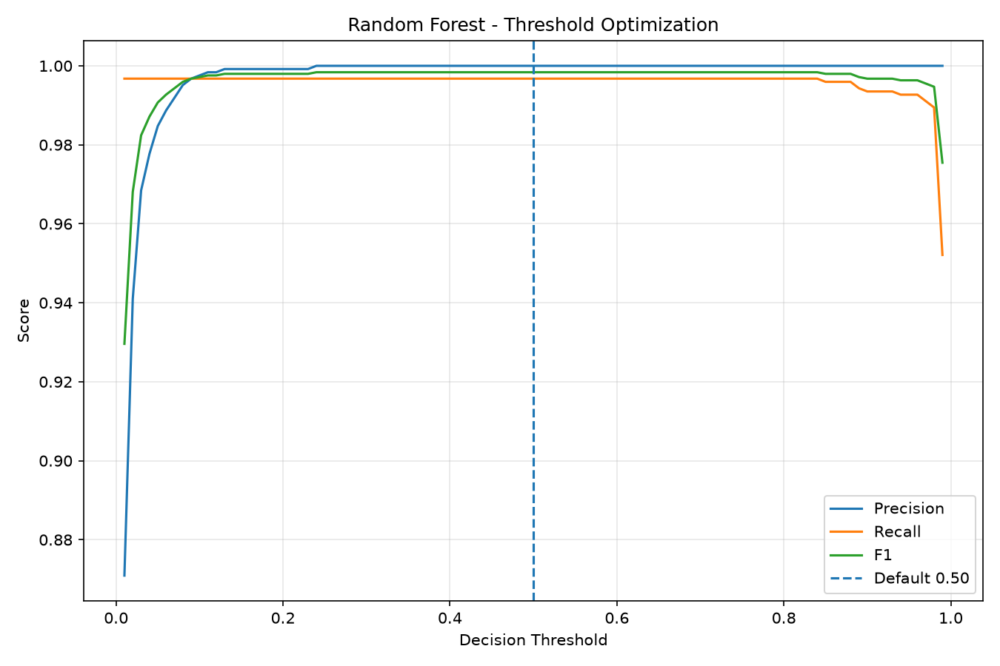
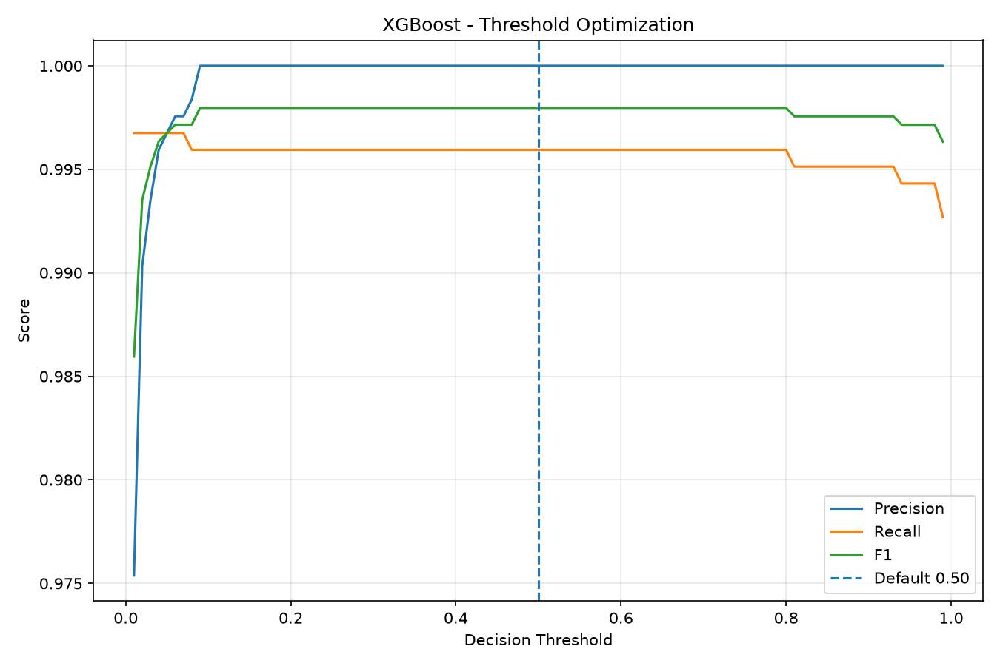
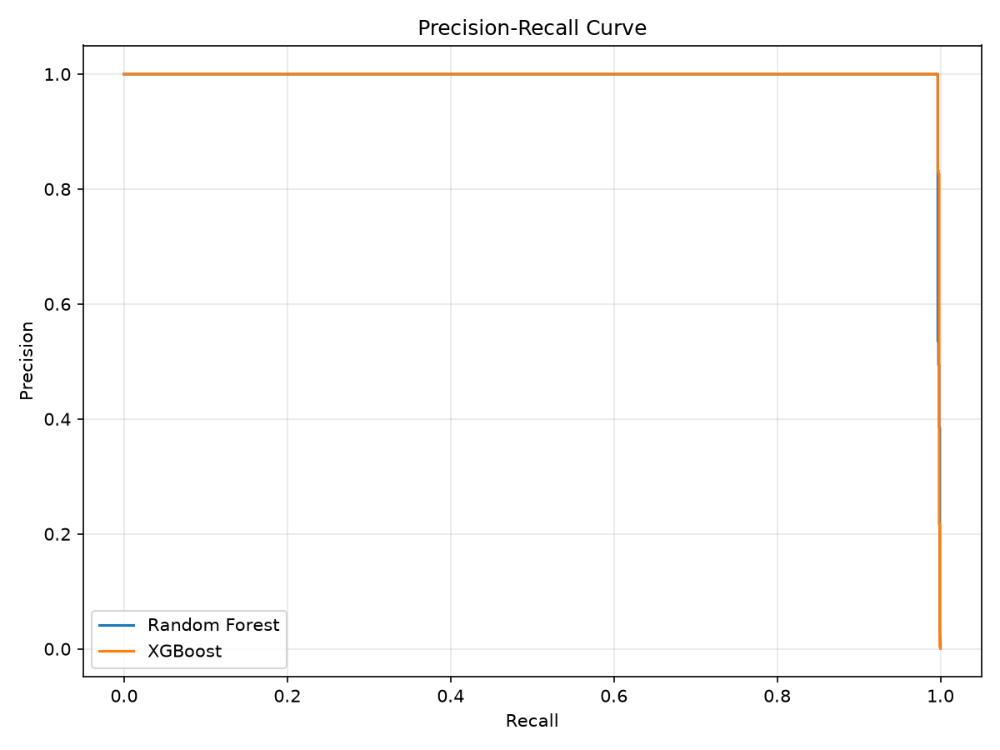
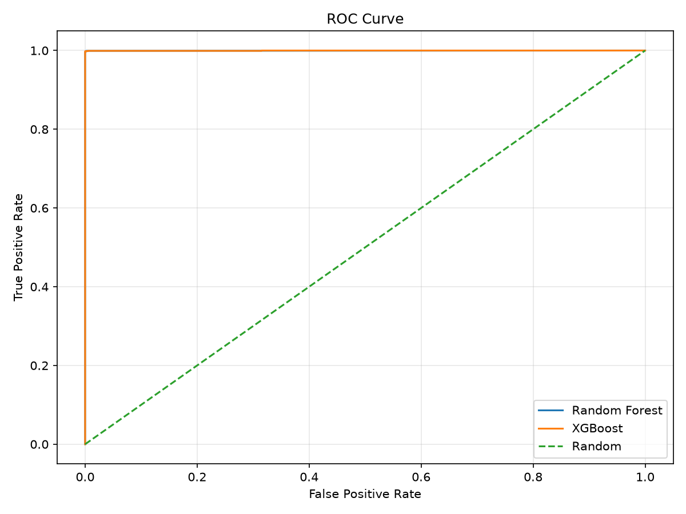
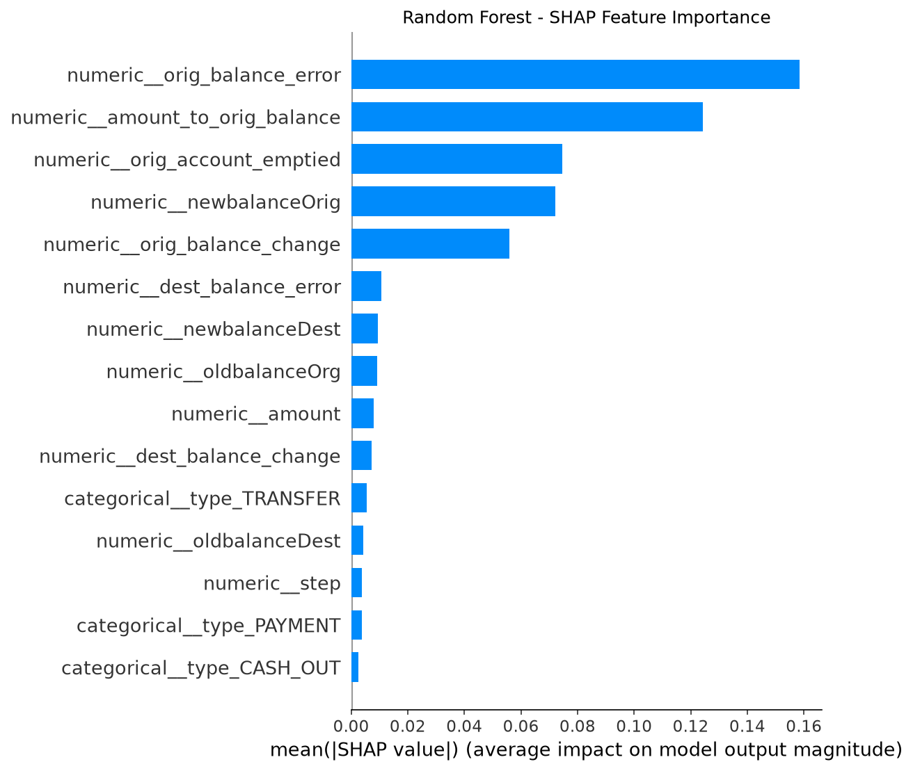
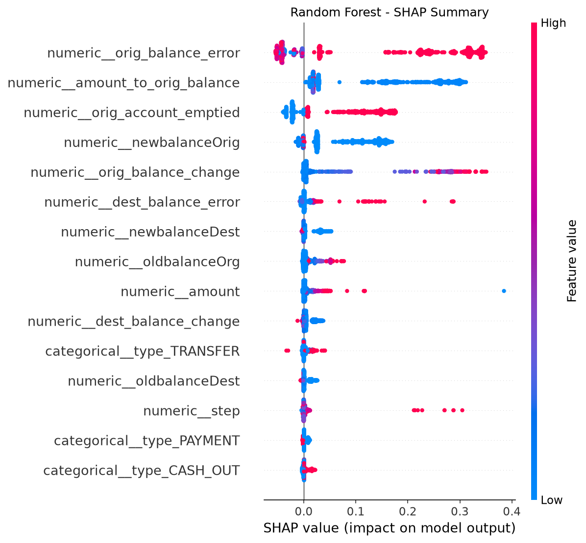

# Fraud Detection System

An end-to-end Machine Learning system for detecting fraudulent financial transactions using the PaySim dataset.

The project covers the complete ML lifecycle: data analysis, preprocessing, feature engineering, model training and comparison, class imbalance analysis, threshold optimization, explainability with SHAP, production API development, an interactive dashboard, automated testing, Docker containerization, and cloud deployment.

## Live Demo

### Streamlit Dashboard
https://cozy-communication-production-435b.up.railway.app

### FastAPI Swagger Documentation
https://fraud-detection-system-production-b261.up.railway.app/docs

### API Health Check
https://fraud-detection-system-production-b261.up.railway.app/health

---

## Project Overview

Financial fraud detection is a highly imbalanced classification problem. In the PaySim dataset, fraudulent transactions represent only a very small percentage of all transactions.

The objective of this project was not only to train a machine learning model, but to build a complete production-style fraud detection system.

The system can:

- Analyze financial transaction data
- Detect fraudulent transactions
- Generate fraud probabilities
- Assign transaction risk levels
- Analyze individual transactions
- Analyze CSV batches of transactions
- Explain model behavior using SHAP
- Serve predictions through a REST API
- Provide an interactive web dashboard
- Run through Docker containers
- Operate as a deployed cloud application

---

## System Architecture

```text
                     User
                      |
                      v
              Streamlit Dashboard
                      |
                      v
                 FastAPI API
                      |
                      v
             Input Validation
                      |
                      v
              Feature Engineering
                      |
                      v
          Production ML Pipeline
                      |
                      v
               Random Forest
                      |
                      v
          Fraud Probability Score
                      |
                      v
        Fraud / Legitimate Decision
                      |
                      v
                Risk Level
```

### Production Deployment

```text
                    Internet
                       |
                       v
             Railway Public Domain
                       |
                       v
              Streamlit Dashboard
                    :8501
                       |
                       |
             Railway Private Network
                       |
                       v
                 FastAPI API
                    :8000
                       |
                       v
          Fraud Detection Pipeline
```

---

## Dataset

The project uses the **PaySim synthetic financial transaction dataset**.

### Dataset Statistics

| Property | Value |
|---|---:|
| Total Transactions | 6,362,620 |
| Fraud Transactions | 8,213 |
| Legitimate Transactions | 6,354,407 |
| Fraud Percentage | 0.1291% |
| Original Features | 11 |

The extreme imbalance makes accuracy alone unsuitable for evaluating the fraud detection system.

For this reason, the project focuses primarily on:

- Precision
- Recall
- F1 Score
- ROC-AUC
- PR-AUC
- False Positives
- False Negatives

### Transaction Types

The dataset contains:

- CASH_OUT
- PAYMENT
- CASH_IN
- TRANSFER
- DEBIT

Fraudulent transactions occur in:

- TRANSFER
- CASH_OUT

The full PaySim dataset is not stored in this repository because of its size.

---

## Exploratory Data Analysis

EDA was performed to understand transaction behavior and fraud patterns.

Important observations included:

- Fraud represents only 0.1291% of all transactions.
- Fraud appears only in TRANSFER and CASH_OUT transactions.
- Fraudulent transactions generally involve larger transaction amounts.
- Sender and receiver balance behavior provides strong signals for fraud detection.

### Transaction Type Distribution



### Fraud by Transaction Type



### Fraud Rate by Transaction Type



---

## Data Splitting

The dataset was split into training, validation, and test sets while preserving the fraud distribution.

| Dataset | Transactions | Fraud Cases |
|---|---:|---:|
| Training | 4,453,834 | 5,749 |
| Validation | 954,393 | 1,232 |
| Test | 954,393 | 1,232 |

The final test set remained untouched until the final production evaluation.

---

## Feature Engineering

Several fraud-specific features were created from the original transaction information.

### Engineered Features

- `orig_balance_change`
- `dest_balance_change`
- `orig_balance_error`
- `dest_balance_error`
- `amount_to_orig_balance`
- `orig_account_emptied`

These features capture behavioral patterns in how account balances change during transactions.

Feature engineering produced a major improvement in fraud detection performance.

### Raw vs Engineered Features

| Feature Set | Precision | Recall | F1 Score | PR-AUC | Missed Fraud |
|---|---:|---:|---:|---:|---:|
| Raw Features | 0.9792 | 0.7646 | 0.8587 | 0.9375 | 290 |
| Engineered Features | 1.0000 | 0.9968 | 0.9984 | 0.9979 | 4 |

The comparison demonstrates that the engineered features substantially improved the model's ability to detect fraudulent transactions.

---

## Machine Learning Models

Three main machine learning models were evaluated.

### Logistic Regression

Logistic Regression was used as the baseline model.

Results:

| Metric | Score |
|---|---:|
| Precision | 0.9286 |
| Recall | 0.5698 |
| F1 Score | 0.7062 |
| ROC-AUC | 0.9962 |
| PR-AUC | 0.7975 |
| Missed Fraud | 530 |

Although ROC-AUC was high, recall was insufficient for fraud detection.

---

## Random Forest

Random Forest produced a major improvement over the baseline.

| Metric | Score |
|---|---:|
| Precision | 1.0000 |
| Recall | 0.9968 |
| F1 Score | 0.9984 |
| ROC-AUC | 0.9996 |
| PR-AUC | 0.9979 |
| Missed Fraud | 4 |

Validation confusion matrix:

```text
True Positives:     1,228
False Positives:        0
False Negatives:        4
True Negatives:   953,161
```

### Random Forest Confusion Matrix


---

## XGBoost

XGBoost was also trained and evaluated.

| Metric | Score |
|---|---:|
| Precision | 1.0000 |
| Recall | 0.9959 |
| F1 Score | 0.9980 |
| ROC-AUC | 0.9997 |
| PR-AUC | 0.9983 |
| Missed Fraud | 5 |

### XGBoost Confusion Matrix



---

## Model Comparison

| Model | Precision | Recall | F1 Score | ROC-AUC | PR-AUC | Missed Fraud |
|---|---:|---:|---:|---:|---:|---:|
| Logistic Regression | 0.9286 | 0.5698 | 0.7062 | 0.9962 | 0.7975 | 530 |
| Random Forest | 1.0000 | 0.9968 | 0.9984 | 0.9996 | 0.9979 | 4 |
| XGBoost | 1.0000 | 0.9959 | 0.9980 | 0.9997 | 0.9983 | 5 |

Random Forest achieved the highest validation F1 score and the lowest number of missed fraudulent transactions.

---

## Handling Class Imbalance

The dataset contains approximately:

```text
Normal Transactions : Fraud Transactions
773.71 : 1
```

XGBoost experiments were performed using different `scale_pos_weight` values:

- 1
- 10
- 50
- 100
- 300
- 773.71

The experiments showed that aggressive class weighting did not improve the overall F1 score compared with the already strong unweighted model.

This demonstrates why imbalance strategies should be evaluated experimentally rather than applied automatically.

---

## Threshold Optimization

The classification threshold was analyzed instead of relying only on the default threshold of `0.50`.

### Random Forest

Best F1 result:

```text
Threshold: 0.24
Precision: 1.0000
Recall:    0.9968
F1 Score:  0.9984
FP:        0
FN:        4
```

### XGBoost

A lower threshold increased recall while introducing a small number of false positives:

```text
Threshold: 0.06
Precision: 0.9976
Recall:    0.9968
F1 Score:  0.9972
FP:        3
FN:        4
```

This demonstrates the trade-off between detecting more fraud and generating false alarms.

### Random Forest Threshold Optimization



### XGBoost Threshold Optimization



---

## Model Evaluation

Because fraud is extremely rare, Precision-Recall analysis is particularly important.

### Precision-Recall Curve



### ROC Curve



---

## Explainable AI with SHAP

SHAP was used to understand which features influence fraud predictions.

### Top SHAP Features

The most influential features included:

1. `orig_balance_error`
2. `amount_to_orig_balance`
3. `orig_account_emptied`
4. `newbalanceOrig`
5. `orig_balance_change`

For one example fraudulent transaction, the model produced:

```text
Fraud Probability: 99.82%
```

The SHAP explanation showed which transaction characteristics increased the fraud prediction.

### SHAP Feature Importance



### SHAP Summary



SHAP makes the system more interpretable by providing insight into why the model considers transactions suspicious.

---

## Production Model

The final production pipeline combines:

```text
Raw Transaction
      |
      v
Feature Engineering
      |
      v
Categorical Encoding
      |
      v
Random Forest
      |
      v
Fraud Probability
```

The complete pipeline is stored as:

```text
models/fraud_detection_pipeline.joblib
```

This allows preprocessing and inference to be performed consistently in production.

---

## Final Holdout Test

The production pipeline was evaluated on the untouched test dataset containing:

```text
954,393 transactions
1,232 fraud cases
```

### Final Results

| Metric | Result |
|---|---:|
| Precision | 1.0000 |
| Recall | 0.9959 |
| F1 Score | 0.9980 |
| ROC-AUC | 0.9987 |
| PR-AUC | 0.9960 |

### Final Confusion Matrix

```text
True Positives:     1,227
False Positives:        0
False Negatives:        5
True Negatives:   953,161
```

The production model detected **1,227 of 1,232 fraudulent transactions** while generating **zero false positives** on the final holdout test at the evaluated threshold.

---

## FastAPI Backend

The machine learning pipeline is served through a FastAPI REST API.

### API Endpoints

| Method | Endpoint | Description |
|---|---|---|
| GET | `/` | API information |
| GET | `/health` | API and model health |
| GET | `/model-info` | Model metadata |
| POST | `/predict` | Analyze one transaction |
| POST | `/predict-batch` | Analyze multiple transactions |

### Live API Documentation

https://fraud-detection-system-production-b261.up.railway.app/docs

---

## Example API Request

```json
{
  "step": 1,
  "type": "TRANSFER",
  "amount": 181,
  "oldbalanceOrg": 181,
  "newbalanceOrig": 0,
  "oldbalanceDest": 0,
  "newbalanceDest": 0
}
```

### Example Response

```json
{
  "prediction": "FRAUD",
  "fraud_probability": 0.9969,
  "threshold": 0.5,
  "risk_level": "CRITICAL"
}
```

---

## Streamlit Dashboard

The Streamlit interface provides two analysis modes.

### Single Transaction Analysis

Users can manually enter transaction information and receive:

- Fraud / Legitimate prediction
- Fraud probability
- Risk level

Example production prediction:

```text
Prediction:        FRAUD
Fraud Probability: 99.69%
Risk Level:        CRITICAL
```

### Batch CSV Analysis

Users can upload a CSV containing multiple transactions.

The dashboard provides:

- Total transactions
- Fraud detected
- Legitimate transactions
- Critical-risk transactions
- High-risk transactions
- Medium-risk transactions
- Low-risk transactions
- Transaction-level probabilities
- Detected fraud table
- Downloadable analysis results

A demonstration dataset is included:

```text
data/portfolio_demo.csv
```

---

## Automated Testing

The project contains automated tests covering the API, model, and preprocessing pipeline.

Tests include:

- Root endpoint
- Health endpoint
- Model information endpoint
- Fraud prediction
- Legitimate prediction
- Batch prediction
- Invalid transaction type handling
- Negative amount rejection
- Empty batch rejection
- Production model existence
- Model loading
- Probability prediction
- Feature engineering columns
- Fraud feature calculations
- Zero sender balance handling

Run the test suite:

```bash
python -m pytest tests -v
```

Result:

```text
15 passed
```

---

## Docker

The project is containerized using two Docker services.

### API Container

```text
Dockerfile.api
```

Runs:

```text
FastAPI + Uvicorn
Port 8000
```

### Dashboard Container

```text
Dockerfile.dashboard
```

Runs:

```text
Streamlit
Port 8501
```

### Docker Compose

The complete application can be started locally with:

```bash
docker compose build
docker compose up
```

Then open:

```text
Dashboard:
http://localhost:8501

API Documentation:
http://localhost:8000/docs

API Health:
http://localhost:8000/health
```

---

## Cloud Deployment

The complete system is deployed using Railway.

Two separate services are deployed:

```text
Streamlit Dashboard
        |
        | Railway Private Network
        v
FastAPI Service
        |
        v
Fraud Detection Model
```

The dashboard communicates with FastAPI internally through Railway private networking.

### Live Dashboard

https://cozy-communication-production-435b.up.railway.app

### Live API

https://fraud-detection-system-production-b261.up.railway.app

---

## Project Structure

```text
fraud-detection-system/
|
|-- api/
|   |-- __init__.py
|   |-- main.py
|   `-- schemas.py
|
|-- dashboard/
|   `-- app.py
|
|-- data/
|   `-- portfolio_demo.csv
|
|-- images/
|   |-- fraud_by_transaction_type.png
|   |-- fraud_rate_by_type.png
|   |-- precision_recall_curve.png
|   |-- random_forest_confusion_matrix.png
|   |-- random_forest_threshold_optimization.png
|   |-- roc_curve.png
|   |-- shap_feature_importance.png
|   |-- shap_summary.png
|   |-- transaction_type_distribution.png
|   |-- xgboost_confusion_matrix.png
|   `-- xgboost_threshold_optimization.png
|
|-- models/
|   |-- fraud_detection_pipeline.joblib
|   |-- metadata.json
|   |-- model_comparison.csv
|   |-- shap_feature_importance.csv
|   `-- threshold_results.csv
|
|-- src/
|   |-- inspect_data.py
|   |-- eda.py
|   |-- preprocessing.py
|   |-- features.py
|   |-- train.py
|   |-- train_random_forest.py
|   |-- train_xgboost.py
|   |-- xgboost_imbalance.py
|   |-- evaluate.py
|   |-- threshold_optimization.py
|   |-- shap_explain.py
|   |-- production_model.py
|   |-- predict.py
|   `-- transformers.py
|
|-- tests/
|   |-- test_api.py
|   |-- test_model.py
|   `-- test_preprocessing.py
|
|-- Dockerfile.api
|-- Dockerfile.dashboard
|-- docker-compose.yml
|-- requirements.txt
|-- requirements-docker.txt
|-- .dockerignore
|-- .gitignore
`-- README.md
```

---

## Technology Stack

### Machine Learning

- Python
- Pandas
- NumPy
- Scikit-learn
- XGBoost
- SHAP
- Joblib

### Backend

- FastAPI
- Pydantic
- Uvicorn

### Frontend

- Streamlit

### Testing

- Pytest

### DevOps

- Docker
- Docker Compose
- Git
- GitHub
- Railway

---

## Key Engineering Decisions

### Stratified Dataset Splitting

Stratified splitting preserves the extremely rare fraud distribution across training, validation, and test datasets.

### Separate Validation and Test Sets

The validation set was used for model comparison and threshold analysis.

The final test set remained untouched until production evaluation.

### Metrics Appropriate for Imbalanced Data

Accuracy was not used as the primary performance metric.

The project emphasizes:

- Precision
- Recall
- F1
- PR-AUC
- ROC-AUC
- False Negatives
- False Positives

### Feature Engineering Validation

The engineered-feature Random Forest was directly compared against a raw-feature Random Forest.

This verified that the performance improvement was associated with the engineered fraud signals.

### Explainability

SHAP was integrated to provide visibility into model behavior.

### Production Pipeline

Feature engineering, preprocessing, and model inference are packaged into a reusable production pipeline.

### API / UI Separation

FastAPI handles model inference independently from the Streamlit interface.

This allows other applications to consume the fraud detection API.

### Containerization

Docker provides reproducible execution across local and cloud environments.

### Private Service Communication

The deployed Streamlit dashboard communicates with FastAPI using Railway's private network.

---

## Future Improvements

Possible extensions include:

- Real-time transaction streaming
- Model monitoring
- Data drift detection
- Prediction logging
- Authentication and API keys
- Rate limiting
- Database integration
- CI/CD with GitHub Actions
- Automated retraining pipelines
- Cloud monitoring and alerting
- Additional fraud detection models

---

## Disclaimer

This is an educational machine learning portfolio project trained on the synthetic PaySim dataset.

The model should not be used for real financial or banking decisions without additional validation, monitoring, security controls, regulatory review, and domain-specific evaluation.